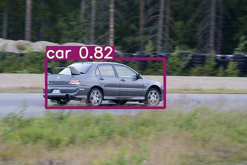
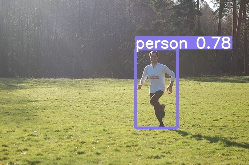
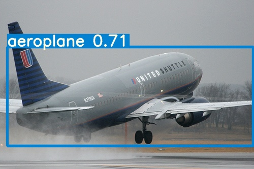
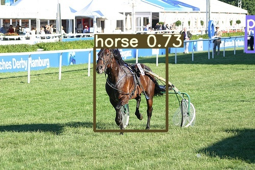
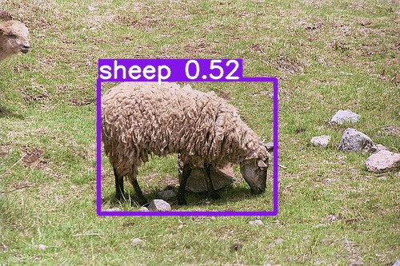
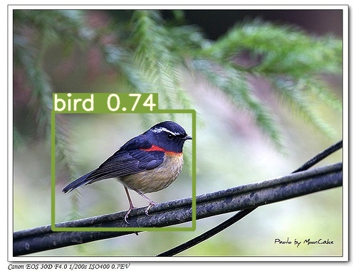
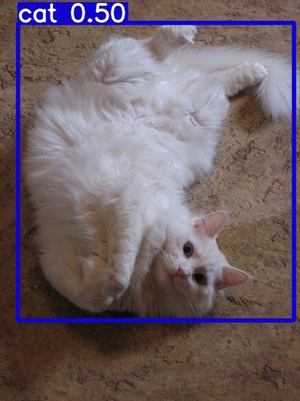
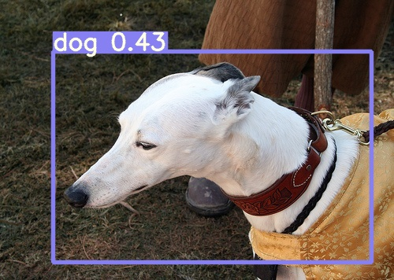

# 🚀 YOLOv5-Lite + Ghost 主干网络 VOC 目标检测（轻量级高精度）

该项目基于 YOLOv5-Lite，并将骨干网络替换为 **Ghost 风格（GhostConv + C3 Ghost）**，结合多策略训练优化，使其在 **轻量化、低显存设备** 上依然保持优秀检测性能，特别适合 **边缘部署与实时检测**。

---

## 🌟 项目亮点

| 分类 | 改进策略 | 效果 |
|------|----------|------|
| 网络结构 | 替换 Backbone 为 **Ghost-style 主干** | 参数更少，推理更快 |
| 数据增强 | Mosaic=0.20、Mixup=0.05 | 提升泛化、抑制过拟合 |
| 输入分辨率 | 416 → **512** | 强化小目标检测 |
| 训练策略 | ExpA（不冻结） vs **ExpB（冻结前 10 层）** | ExpB 最优 |
| 部署能力 | 超轻量级模型 | 低显存 GPU / 边缘设备可运行 |

---

## 📌 最终性能对比

| 方案 | 输入尺寸 | Backbone | 冻结 | mAP@0.5 | 说明 |
|------|----------|----------|------|--------|------|
| Baseline 初始模型 | 416 | 原版 | ✗ | **0.321** | 无优化 |
| ExpA | 512 | Ghost | ✗ | **0.344** | 分辨率提升 |
| **🚀 ExpB（最佳）** | 512 | Ghost | ✓（前 10 层） | **0.394 → 0.400** | 最优模型 |

📌 结论：**Ghost 主干 + 冻结策略在轻量模型中显著提升 VOC 检测性能，且推理速度保持极快。**

---

## 📸 推理效果展示（8 张 Demo 图片）

<div align="center">
 
 
 
 
 
 
 
 
</div>

---

## 🧠 环境

| 项目 | 推荐版本 |
|------|----------|
| Python | 3.8 – 3.10 |
| PyTorch | ≥ 1.11（建议 2.0+） |
| CUDA | 11.x / 12.x |
| GPU | ≥ 4GB 可训练，2GB 可推理（如 MX450） |

安装依赖：
```bash
pip install -r requirements.txt

🔍 推理 (Inference)

python detect.py \
  --weights runs/train/exp18/weights/best.pt \
  --source demo_images \
  --img 512 \
  --conf 0.25

推理结果输出目录：

runs/detect/exp/

🏋️‍♂️ 训练 (Training)

python train.py \
  --cfg models/v5Lite-ghost-s.yaml \
  --weights '' \
  --data data/voc.yaml \
  --img-size 512 \
  --batch-size 2 \
  --epochs 25 \
  --hyp data/hyp.scratch-low.yaml \
  --workers 2

🔁 继续训练 / 微调

python train.py \
  --cfg models/v5Lite-ghost-s.yaml \
  --weights runs/train/exp18/weights/best.pt \
  --data data/voc.yaml \
  --img-size 512

📦 预训练权重
模型	文件路径	用途
最佳模型（推荐部署）	runs/train/exp18/weights/best.pt	推理 / 迁移学习
最新模型	runs/train/exp18/weights/last.pt	继续训练
📂 项目结构

YOLOv5-Lite
 ├─ models
 │   ├─ v5Lite-ghost-s.yaml        # Ghost 主干网络
 ├─ data/voc.yaml                  # VOC 数据集配置
 ├─ runs/train/exp18               # 最优训练实验
 ├─ demo_images                    # 推理示例图片
 ├─ detect.py / train.py           # 推理 / 训练脚本
 └─ requirements.txt

📜 许可协议

本项目遵循 GPL-3.0 协议，仅供研究与非商业用途。
📧 联系方式

Author: Zhuz0123
Email: 953153859@qq.com

📌 如果本项目对你有帮助，欢迎 Star ⭐